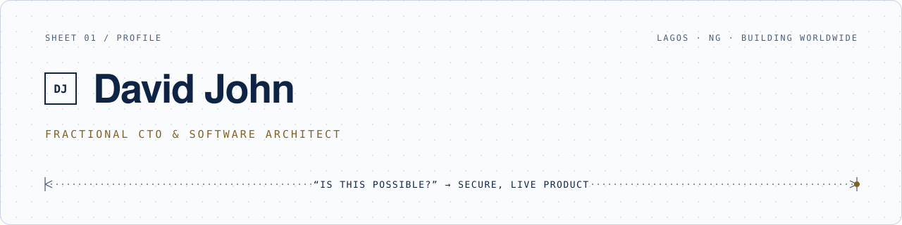

<picture>
  <source media="(prefers-color-scheme: dark)" srcset="./assets/banner-dark.svg">
  
</picture>

### I help founders go from _"is this even possible?"_ to a secure, live product.

You bring the problem. I bring the judgment: what to build, what to skip, and how to keep it standing once real people use it. Five years shipping production systems for teams in Nigeria, the UK and the US.

**Now:** architecture for [CreditVeto](#selected-work) and [LexiLead](#selected-work) · building AI systems that hold up in regulated industries · writing on architecture and AI in production

 

## Selected work

Most of my work runs in private client repositories. Here is what it does.

| Product        | Domain                     | The problem, and what I did                                                                                                                                               |
| -------------- | -------------------------- | ------------------------------------------------------------------------------------------------------------------------------------------------------------------------- |
| **PLSOM**      | Education · NG             | Rebuilt a live learning platform piece by piece while classes carried on. Two years on, students still log in every week.                                                 |
| **Trakitt**    | Healthcare compliance · UK | Tamper-proof incident and complaint records plus alert escalation across the 41 measures the CQC framework checks. Inspection day becomes a printout.                     |
| **CreditVeto** | Fintech · NG               | Identity checks, a real-time fraud engine and a verifiable credit score. New fraud rules run in watch-only mode first. Close to 1,000 transactions ahead of wider launch. |
| **ALi**        | AI · Knowledge work        | Company knowledge assistant. Paired keyword and semantic search, then let the agent page through results like a person. Piloted by two organisations.                     |
| **LexiLead**   | Legal tech · NG            | Limitation-period tracking and conflict checks for law firms. I lead architecture and backend. In pilot.                                                                  |
| **Shotkeet**   | AI · Video                 | Prompt to finished video in about three minutes. Built end to end, from render pipeline to UI.                                                                            |

[More work and case studies →](https://mcsavvy.is-a.dev)

 

## How I work

**Discovery.** I ask what solving this earns or saves you, then write back what I heard. You confirm before any code exists. 
**Architecture.** A plan you can see: what ships first, what waits, what it costs. Then I freeze v1 so it ships. 
**Build.** Design, AI and engineering, with you testing as it grows. 
**Launch.** Secured, deployed and watched. I stay on after go-live.

 

## Latest writing

<!-- BLOG-POST-LIST:START -->
<!-- BLOG-POST-LIST:END -->

[All articles on Medium →](https://medium.com/@mcsavvy)

 

## Stack

**Languages** · TypeScript, Python, SQL, Clarity, Solidity 
**Backend** · NestJS, FastAPI, Django, PostgreSQL + pgvector, Redis, BullMQ 
**Frontend** · Next.js, React, Tailwind, TanStack Query, PWAs 
**AI** · Claude, LangGraph, LangChain, hybrid RAG, evaluation and guardrails 
**Infra** · Docker, Turborepo, GitHub Actions, Coolify, Hetzner, Vercel, AWS, Cloudflare

 

## Let's talk

Tell me the idea. I'll tell you if it's possible.

**[Book a 30-minute "Is It Possible?" call →](https://calendar.app.google/kk2oCLz1PuEsUuwL9)**

[Website](https://mcsavvy.is-a.dev) · [LinkedIn](https://linkedin.com/in/davemcsavvy) · [Medium](https://medium.com/@mcsavvy) · [X](https://x.com/davemcsavvy) · [davidjohn@futurdevs.com](mailto:davidjohn@futurdevs.com)
